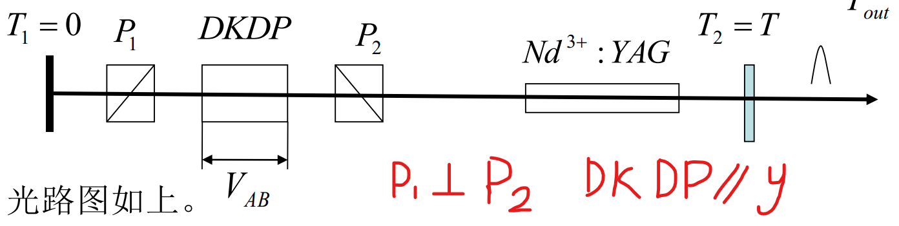

<!--
Using KaTeX to render formula
Settings:

================================================================
Markdown All in One Plugin (for VSCode) Settings
================================================================
"markdown.extension.katex.macros": {
        "\\bra":"\\left|{#1}\\right>",
        "\\ket":"\\left<{#1}\\right|",
        "\\ketbra":"\\left<{#1}|{#2}\\right>",
        "\\braket":"\\left|{#1}\\right>\\left<#2\\right|",
        "\\pfrac":"\\frac{\\partial #1}{\\partial #2}",
        "\\difrac":"\\frac{\\textrm{d}{#1}}{\\textrm{d}{#2}}",
        "\\Tr":"\\textrm{Tr}",
        "\\abs":"\\left|#1\\right|",
        "\\measure":"\\left<#1\\right>",
        "\\matrix":"\\left[\\begin{matrix}#1\\end{matrix}\\right]",
        "\\pmatrix":"\\begin{pmatrix}{#1}\\end{pmatrix}",
        "\\equset":"\\left\\{\\begin{matrix}#1\\end{matrix}\\right."
},

================================================================
LaTeX newcommand format
================================================================
$$
\newcommand{\bra}[1]{\left|{#1}\right>}
\newcommand{\ket}[1]{\left<{#1}\right|}
\newcommand{\ketbra}[2]{\left<{#1}|{#2}\right>}
\newcommand{\braket}[2]{\left|{#1}\right>\left<#2\right|}
\newcommand{\pfrac}[2]{\frac{\partial #1}{\partial #2}}
\newcommand{\difrac}[2]{\frac{\textrm{d}{#1}}{\textrm{d}{#2}}}
\newcommand{\Tr}{\textrm{Tr}}
\newcommand{\abs}[1]{\left|#1\\right|}
\newcommand{\measure}[1]{\left<#1\right>}
\newcommand{\matrix}[1]{\left[\begin{matrix}#1\end{matrix}\right]}
\newcommand{\pmatrix}[1]{\begin{pmatrix}{#1}\end{pmatrix}}
\newcommand{\equset}[1]{\left\{\begin{matrix}#1\end{matrix}\right.}
$$

-->

# 激光原理与技术

## 光学谐振腔的稳定性条件

近轴近似：$\theta << 1,\sin\theta=\theta$；球面波
传输矩阵：
$$M=\matrix{A&B\\\\C&D}$$

自由空间的传输矩阵

$$\matrix{x_2\\\\\theta_2}=\matrix{1&L\\\\0&1}\matrix{x_1\\\\\theta_1}$$

薄透镜的传输矩阵：
$$M(f)=\matrix{1&0\\\\-\frac1f&1}$$

球面反射镜：
$$M(R)=\matrix{1&0\\\\-\frac2R&1}$$

界面折射：
$$M(n_1,n_2)=\matrix{1&0\\\\0&\frac{n_1}{n_2}}$$

折射率n长度为L的均匀介质：
$$M(n,L)=\matrix{1&\frac Ln\\\\0&1}$$

球面波半径
$$\frac{x_1}{\theta_1}=R_1$$
$$\therefore R_2=\frac{AR_1+B}{CR_1+D}$$

对于稳定的序列，光束是有界的，i.e.$M_n$的矩阵元为有限的实数，要求矩阵元为实数，则要求θ为实数。i.e.
$$-1<\frac12 (A+D)<1$$

对于双球面反射镜谐振腔（中间无其他元件），稳定性条件为：
$$0<\left(1-\frac L{R_1}\right)\left(1-\frac{L}{R_2}\right)=g_1g_2<1$$
其中凹面镜向着腔内时，R为正，凸面镜为负

介稳腔：$g_1g_2=0或1$。$g_1g_2=1$时，$R_1,R_2\to\infty, \text{i.e.}$平面镜腔；当$g_1=g_2=0$时为共焦腔，此时腔内光场有解析解。

已知一曲面上光场分布函数$u(x',y')$

一般认为, 经过第q次反射之后, 形成一个相对稳定的场分布$E_q(x,y)=\gamma E_{q+1}(x,y)$, $\gamma$为一个复常数, 称作激励模式. 思路:用计算机计算到q次之后得到一个稳定的场分布

经过j次渡越后所生成的场与产生它的场之间亦
应满足类似的迭代关系
$$
\mathrm{u}_{\mathrm{j}+1}(x, y)=\frac{i k}{4 \pi} \iint u_{\mathrm{j}}\left(x^{\prime}, y^{\prime}\right) \frac{e^{-i k \rho}}{\rho}(1+\cos \theta) d s^{\prime}
$$
按照自再现观点，当渡越次数j足够大时，
除了一个表示振幅衰减和相位移动的复常
数因子$\gamma$以外，$u_{j+1}$应该再现$u_j$. 故有:

$$
\mathrm{u}_{\mathrm{j}}(x, y)=\gamma\frac{i k}{4 \pi} \iint u_{\mathrm{j}}\left(x^{\prime}, y^{\prime}\right) \frac{e^{-i k \rho}}{\rho}(1+\cos \theta) d s^{\prime}
$$
以上为开腔中自再现模应该满足的方程

当腔长L和镜半径(线度)a满足$L>>a$时, 有
$$\frac{1+\cos\theta}{\rho}\simeq\frac2L$$

考题: 分别画出高斯光束和拉盖尔光束的的光斑形式

锁模激光器

单一模激光器

### 方形实对称共焦球面镜光学谐振腔中光场行波场

#### 考题

考题: 基膜高斯光束和平面光的区别是什么?

在中间平面, 两种光的等相位面一样, 都是平面

与球面波比较, 他的等相面是球面, 但球面波的曲率半径$R(z)=z$, 高斯光:$R(z)=\abs{z+\frac {f^2}{z}}^2$

振幅: 球面波$\frac1R$, 高斯光:$e^{-\frac{x^2+y^2}{w_{+0s}^2}}$

$\frac1{q_1}=\frac1{R(z)}-i\frac{\lambda}{\pi W(z)}$

求q1, 求所有矩阵相乘得到ABCD, $q_2=\frac{Aq_1+B}{Cq_1+D}$

# 第四章 激光器震荡、输出特性

$\Delta n_i$: 粒子反转数密度

## 速率方程组

描述激光器震荡输出特性的理论方法:

- 量子方法 - 激光的严格理论体系
  - 两个能级都有很多粒子, 光有时和高能级相互作用, 有时和低能级相互作用
  - 可以严格地描述很多现象
  - 计算繁琐
- 兰姆理论 - 半经典理论
  - 利用密度矩阵进行简化
  - 计算依然繁琐
- 速率方程方法 - 唯象理论
  - 对光和物质都作量子化描述, 但忽略位相问题, 只考虑光子数
  - 不考虑统计分布特性, 只考虑处于某状态的光子数的期望值
  - 我们在用的方法

单纯的二能级系统不能连续稳定运转

很多能级时可以简化为三能级或四能级:

"基态"能级: 只能从这里向上跃迁的能级, 粒子被抽运的最低能级

自发辐射:
$$E_n-E_1=h\nu_p$$
$\nu_p$是等效波长

泵浦$W_p>>E_n-E_1$, 要用大功率泵浦, 使得大量粒子被泵浦至吸收态(最高能级)

### 四能级系统

S为无辐射跃迁速率, T为模体积
$$\eta_1=\frac{S_{43}}{A_{41}+S_{41}+S_{43}}$$
$$\equset{
        n_1+n_2+n_3+n_4=n\\\\
        \difrac{n_1}{t}=n_2 S_{21}+n_4(A_{41}+S_{41})-n_1 W_p\\\\
        \difrac{n_3}{t}=n_4 S_{43}+W_{23} n_{2}-W_{32} n_3-n_{3}(S_{32}+A_{32})\\\\
        \frac{d n_{4}}{d t}=n_{1} W_{p}-n_{4}\left(S_{41}+A_{41}\right)-n_{4} S_{43}
}$$
光子数变化:
$$\difrac{\varphi}{t}=受激辐射+自发辐射+受激吸收+损耗$$

### 三能级系统

## 激光震荡的阈值特性

$$G=\sigma \Delta n$$
$$G\geq\frac{\gamma}{l}=G_t$$
$$\frac{G}{G_t}=\frac{\Delta n}{\Delta n_t}$$
$G_t$为阈值

$w_p$和$\Delta n$有关系
$w_{pt}$阈值泵浦功, $p_{pt}$阈值泵浦功率
当$p_p\geq p_{pt}$时, 才能产生激光

泵浦超阈值度:
$$\beta_s:=\frac{p_p}{p_{pt}}=\frac{w_p}{w_{pt}}\neq\frac{\Delta n}{\Delta n_t}=\frac{G}{G_t}$$

阈值条件:
$$\difrac{\varphi}{t}>0$$
稳态:$\difrac{\Delta n}{t}=0$

必考题

- 给定曲率半径和腔长
  - 问腔型: 算$0<g_1g_2<1$
  - 等价共焦腔的位置: $Z_1, Z_2$
  - 共价共焦腔长: $L'$
  - 两腔镜上的光斑尺寸$W(z_1),\,W(z_2)$
  - 束腰半径: $w_0=\sqrt{\frac{L\lambda}{2\pi}}$
  - 远场发散角: $\frac{\theta}{e^2}=\frac{\lambda}{\pi W_0}$
  - 模体积: $V$
  - 要选出基横模, 问在输出镜附近加小孔光阑的孔径

## 稳态激光的输出功率特性

$$\tau_t=\frac{L}{\gamma_tc}$$
$$\tau_R=\frac{L}{\gamma c}$$
$$P_{out}=\frac{h\nu \varphi}{\tau_t}$$
$$\gamma = \gamma_t+\gamma_o$$

四能级激光器: 稳态情况下
$$\Delta n_s\simeq \Delta n_t$$

光子的多少取决于$\varphi$

空间烧孔: 介质中沿腔轴各点的反转粒子数密度和增益系数呈周期性分
布

兰姆凹陷: 强非均匀加宽连续波运转过程中, 中心频域的增益比两边低

- 条件: $\frac{\Delta \nu_H}{\Delta \nu_q}\leq\frac{1}{20}$, 单模震荡
- 可利用兰姆凹陷进行激光稳频:
  - 寻找中心频率: 调整腔长, 功率计极小值
  - 用压电陶瓷在反射镜处收集信号, 利用伺服系统调整腔长

## 激光束的频率, 空间, 时间特性

### 频率特性

$\lambda_0, \nu_0, \Delta\lambda, \Delta\nu$

$W_p\to\Delta n(\nu)\overset{\sigma}{\to}G(\nu)$

$\Delta \nu_s$可震荡频率范围

模式竞争: 一开始是纵模, 连续波激光器不断运行, 光强不断增加

- 强均匀加宽, 不考虑空间烧孔效应
  - $G^0>G_t$(阈值达成)
  - $I(\nu)<I_s(\nu)$(增益上升)
  - $I(\nu_0)>I_s(\nu_0)$(中心频率增益饱和)
  - $I(\nu)<I_s(\nu)$(整体增益下降)
  - $\Delta n\downarrow$
  - $G=\sigma\Delta n\downarrow$
  - 增益下降至只有中心频率(附近)有激光
- 非均匀加宽, 考虑烧孔效应
  - 对应频率超过饱和光强, 烧孔
  - 所有纵模都可以起振, 在阈值附近
  - *需要选模

色散元件+反射镜=改变阈值$G_t(\nu)$

制造均匀激光: 反高斯函数透过率膜 + 反高斯函数反射率反射镜

频率牵引:

每个模式的宽度: $\Delta \nu_{激}$ ; 每个模式之间间隔: $\Delta\nu_q=\nu_{0,q+1}-\nu_{0,q}$

在腔中间插入折射率不同的介质=引入额外相位 $\Delta\Phi=\frac{2\pi\nu}{c}\cdot2L+\delta\Phi(\nu)\cdot2l=q\cdot2\pi$, 导致相速变化, 导致其他模式频率向中心频率靠拢.

$\delta \Phi=\frac{2\pi\nu}{2c}\cdot\chi'(\nu)$

$$\nu_q=\nu_q^0+\delta\nu_q$$
$$\delta\nu_q=-\frac{\delta\Phi(\nu_q)l}{L/c}\frac{1}{2\pi}$$
$\chi'$为介质线性极化系数实部

线性光学与非线性光学

$$\overrightarrow{E_{out}}\propto\vec{P}=\sum_{n}\hat{\chi}^{(n)}(\vec{E}_{in}(\nu_1,\nu_2))^{\otimes n}$$

一般:$\chi^{(1)}>>\chi^{(2,3,...)}$

激光倍频:$\vec{E}_{1,2}=\vec{E}_0\cos (2\pi\nu_{1,2}l+\phi_{1,2})$

对非线性二次项, 可做直积, 积化和差得到出现倍频, 光强与原频率光强的平方成正比

三阶非线性: 拉曼散射, 四波混频, 克尔效应

#### 单模激光器的线宽极限

### 激光束的空间特性

主要给出: 远场发散角$\vartheta_{1/e^2}$, 模式, 模平方因子$M^2$

- $\beta:=\frac{实际光束的远场发散角}{理想光束的远场发散角}$
- 聚焦光斑尺寸(直径): 假定为理想透镜聚焦下聚焦光斑的尺寸
  - 实际测量中, 若实际激光束聚焦光斑尺寸为爱里斑直径的N倍, 则称为N倍衍射极限
- 斯特列尔比
  - $$S_R:=\frac{实际光束聚焦处的峰值功率}{理想光束聚焦处的峰值功率}$$
  - $S_R\leq1, S_R\uparrow$, 光束质量越高
- $M^2$
  - $M^2:=\frac{实际光束的空间束宽积}{理想光束的空间束宽积}=\frac{实际光束的光束宽度\times远场发散角}{理想光束的光束宽度\times远场发散角}$

### 时间特性

P, 重复频率$f$, 脉宽$\Delta t$ for 单次脉冲, 周期T, 单脉冲: 能量$\Delta E$, 脉宽$\Delta t$, 峰值功率$P_m=\frac{\Delta E}{\Delta t}$; 重复: 脉宽, 平均功率

# 激光调Q原理和技术

6、7种技术, 其中一种考试

调Q=调损耗+调增益

$Q=2\pi\nu\tau_R(t)=2\pi\nu\frac{L}{\gamma(t) c}$

## 理想阶跃开关下调Q

阶跃开关函数: $\gamma=\left\{\begin{matrix}\gamma_1 & (t<t_1)\\\\\gamma_0&(t>t_1)\end{matrix}\right.(\gamma_0 < \gamma_1)$

从泵浦开始到$t_1$时刻, 粒子翻转数密度不断增加, 在$t_1$(泵浦中间最高处)产生阶跃, 此时粒子反转数密度$\Delta n_i >\frac{\gamma_1}{cl}$, 激光经历延迟过程($t_d-t_1$), 经过雪崩过程产生激光. 随后粒子反转数密度下降, 当达到阈值$\Delta n_t$时, 激光输出达到峰值, 随后粒子反转数密度小于阈值, 对光子数没有贡献, 输出光子数近似指数衰减至0.

光路图中, 一般调Q器是一个电光晶体+一个偏振片

如果泵浦时间过长, 粒子反转数密度又会大于阈值, 产生额外的激光, 因此需要关闭阶跃开关.
如果想持续产生, 需要重复开关.

声光调Q, $\gamma_0,\gamma_1$差别很小; 电光调Q, $\gamma_1$可以趋于无穷

$1+\frac{g_2}{g_1}=2^*$(三能级=$2^*=1+\frac{g_2}{g_1}$, 四能级$2^*=1$)

产生一个光子: 消耗$2^*$个粒子反转数密度

$$E=(\Delta n_i-\Delta n_f)/2^*$$

# ???

偏振棱镜: 两块双折射晶体用加拿大树胶黏合

偏振膜片: 

**简述(仅列出)/详细说明(要讲物理过程) 两个正交的偏振器中间加一个电光晶体(KDP), 在激光技术中有什么应用?**

1. 电光调Q
   1. 入射y平行光, 加1/2波电压, 则转为x平行光
   2. 加1/4波电压(1/2波电压的一半), x,y向分量振幅相等, 相位差$\pi/2$, 则为圆偏振光
   3. 其他情况为椭偏光, 长短轴的比例取决于电压大小
   4. 不加电压: 入射光=出射光
   5. $V_{AB}=V_{1/2}$ 全出
   6. $E_x\propto V_{AB}$ x方向的分量才能射出
2. 加压式电光调Q开关
   1. 不加压 = 无光
   2. 加压$V_{1/2}$ = 有光
   3. 
   4. 文字描述, 见PPT, 简略说一下就好
   5. 一定要抄下来的: 时序关系图
3. 选单脉冲开关
4. 电光斩波器或削波器
5. 直流式再生放大器开关
6. 锁模调制器
7. 电光隔离器

