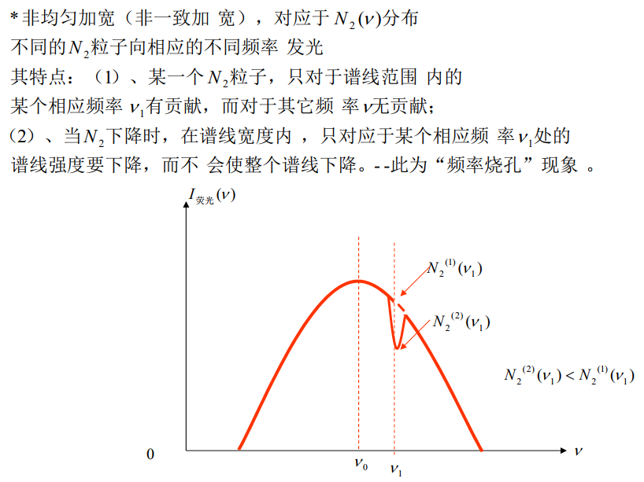
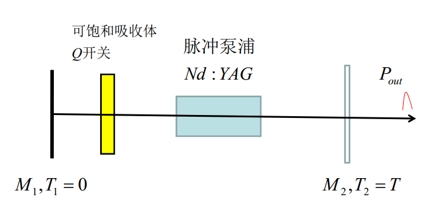
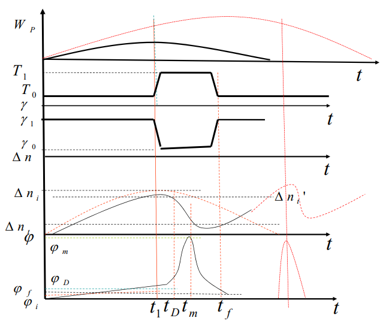
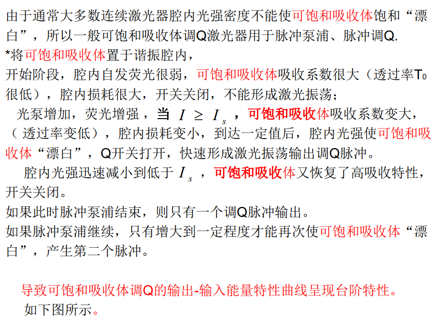
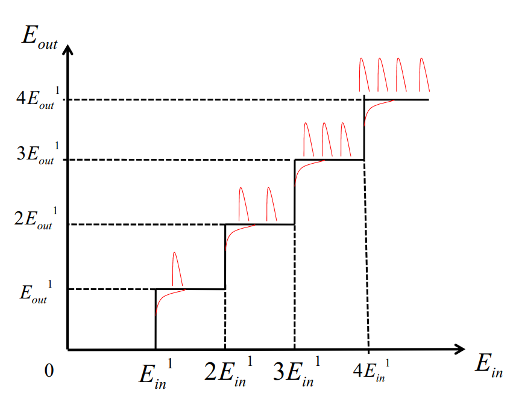
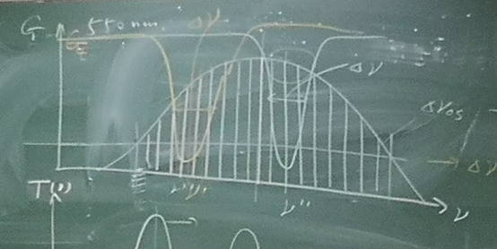
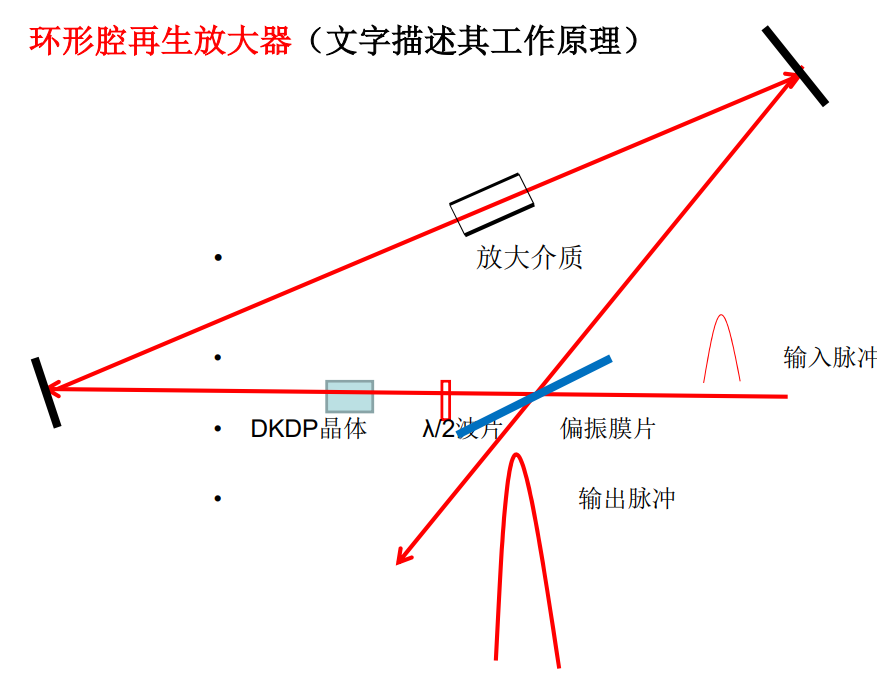
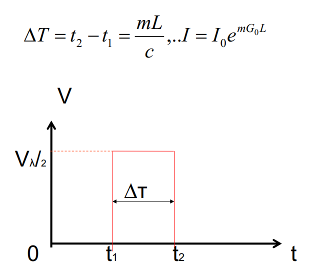
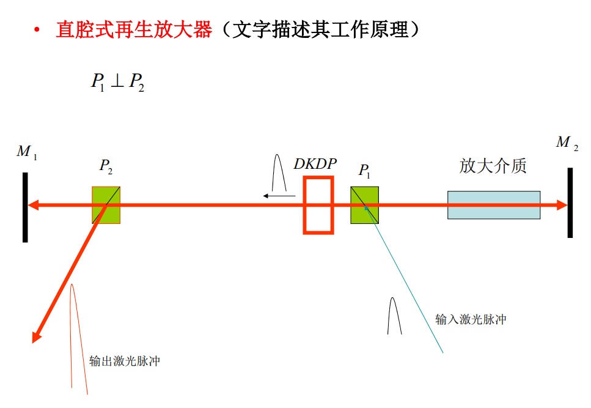

# 考题

[TOC]

## 激光原理

### 第一章   激光的物理基础

#### 1.1 $A_{21}$的测定？

==课件1#P113==  <strong>必考</strong>

测出自发辐射光强随时间变化曲线（荧光曲线）, 时刻$t_1$的自发辐射光强记作 $I_0$, 光强下降到 $I_0/e$ 的时刻记作 $t_2$, 则$\tau_{21}=t_2-t_1$, 从而得到$A_{21}=1/\tau_{21}$.

---

#### 1.2 如何使得受激辐射过程超过自发辐射和受激吸收？

==课件1#P120==

1. 选择具有容易实现粒子数反转的、合适能级结构的粒子系统. -- 工作物质
2. 有外界给该粒子系统提供能量泵浦 (或抽运). -- 泵浦源
3. 提高光子数或降低模式数, 用光学谐振腔获得正反馈同时由于其选择性损耗特性可大大减少模式数, 工作物质的增益饱和特性也可以减少模式数.  -- 光学谐振腔

---

### 第二章 工作物质的增益特性 

#### 2.1 对连续波运转的激光器, 设计一个实验, 测量在一定的泵浦下的粒子反转数密度$\Delta n^0$（以小信号情况为例）

==课件2#P31==
$$
G(\nu,I,z)=\frac{A_{32}\upsilon ^2}{8\pi\nu^2}\cdot\phi(\nu)\cdot\Delta n(\nu,I)
$$

- 增益系数 $G(\nu,I,z)$ 通过实验测得 (功率计)
- 自发辐射系数 $A_{32}$ 由荧光曲线测定 (快速光电探测器+示波器)
- 线型函数 $\phi(\nu)$ 由荧光光谱测定 (光谱仪+计算机)
- 频率 $\nu$ 取中心频率 $\nu_0$
- 介质中的光速为 $\upsilon$

---

#### 2.2 概念辨析：频率烧孔, 频率牵引, 空间烧孔, 兰姆凹陷

- 频率烧孔
  
- 非均匀加宽工作物质的自发辐射(荧光曲线)
  
    ==课件1#P8==
  
  
  
  - 非均匀加宽的工作物质的增益饱和
  
    - 对于频率为 $\nu$ 的光, 随着光强 $I(\nu)$ 的增加, 在增益曲线上频率为 $\nu$ 处增益下降, 出现 "频率烧孔" 现象. 示意图见题 **2.3**
  
  - 这里有**两种**频率烧孔
  
- 兰姆凹陷
  
  ==课件4#P69==
  
  - 强非均匀加宽介质, 连续波运转, 频率中心出现凹陷
  - 当激光的振荡模的频率被调谐至介质能级跃迁中心频率 $\nu_0$ 时,输出功率呈现某种程度的降低 
  
- 空间烧孔
  
  - 由于驻波效应, 某个频率的光强超过饱和光强时, 粒子反转数密度和增益系数在工作物质的轴向会产生一个周期性分布
  
- 频率牵引
  
  - 由于介质极化, 实际激光器 (有源腔) 的精确谐振频率偏离无源腔相应的模频率, 且更靠近激活介质粒子跃迁的中心频率

---

#### 2.3 图示说明强均匀加宽和强非均匀加宽工作物质增益饱和的特性及其区别.

==课件2#P35==

==课件2#P35==

---

### 第三章 光学谐振腔及其模特性

#### 3.1 厄米-高斯光束和拉盖尔-高斯光束的绘制

==《激光原理》p73 圆形镜$TEM_{22}$ <strong>有误</strong>==

- 方形镜子, 画出厄米-高斯光束 $TEM_{mnq}$ 的模瓣以及每个模瓣的振动方向
  - 横向 $m$ 条节线, 纵向 $n$ 条节线
  - 模瓣数目为 $(m+1)\times(n+1)$
  - 相邻模瓣相位相差 $\pi$
- 圆形镜子, 画出拉盖尔-高斯光束 $TEM_{plq}$ 的模瓣以及每个模瓣的振动方向
  - 径向 $p$ 个节线圆, 角向 $l$ 条节线
  - 模瓣数目为 $(p+1)\times(l+1)$
  - 相邻模瓣相位相差 $\pi$

---

#### 3.2 基模高斯光束与平面波、球面波的区别

- 位相
  - 平面波 
    - 高斯光束在 $z=0,\pm\infty$ 三个位置波面都是平面
  - 球面波 
    - 两者等相位面都是球面
    - 两者半径不同
    - 球 $R(z)=z$
      - 高斯 $R(z)=\left|z+f^2/z\right|$
  
- 振幅
  - 平面波
    - 1
  - 高斯
    - $\exp\left[-(x^2+y^2)/{\omega_{0s}^2}\right]$
  - 球面波
    - 1/Z

---

#### 3.3 一般稳定球面镜腔及等价共焦腔

==《激光原理》p74 (2-8-3) 式1 <strong>有符号错误</strong>====, 课件3#P22== <strong>必考</strong>

- 这是一道有7小问的大题

- 本题的任务是给定腔参数 $R_1, R_2, L$ 并满足稳定条件 $0<g_1g_2=\left(1-\frac L{R_1}\right)\left(1-\frac L{R_2}\right)<1$, 求得 $f,z_1,z_2$ 即确定等价共焦腔的中心位置及焦距. 

  - 由高斯光束曲率半径公式易得
    $$
    \begin{equation}
    \left\{
    \begin{aligned} 
    &R_1=-\left(z_1+\frac{f^2}{z_1}\right)\\
    &R_2=\left(z_2+\frac{f^2}{z_2}\right)\\
    &L=z_2-z_1
    \end{aligned}
    \right.
    \end{equation}
    $$
    从而解得
    $$
    \begin{equation}
    \left\{
    \begin{aligned} 
    &z_1=\frac{L(R_2-L)}{(L-R_1)+(L-R_2)}=-\frac{g_2(1-g_1)L}{g_1+g_2-2g_1g_2}\\
    &z_2=\frac{-L(R_1-L)}{(L-R_1)+(L-R_2)}=\frac{g_1(1-g_2)L}{g_1+g_2-2g_1g_2}\\
    &f^2=\frac{L(R_1-L)(R_2-L)(R_1+R_2-L)}{[(L-R_1)+(L-R_2)]^2}=\frac{g_1g_2(1-g_1g_2)L^2}{(g_1+g_2-2g_1g_2)^2}
    \end{aligned}
    \right.
    \end{equation}
    $$
    
  - **注意** $R_1$, $R_2$ 以凸向腔外为正
    
  - **注意** 稳定性条件
  
- 从而可以确定这个腔的模性质, 如
  
  - 等价共焦腔腔长 $L'=2f$
  
  - 束腰半径 $w_0=\left(\frac{\lambda L}{2\pi}\right)^{1/2}$ 及任意位置光斑半径
    $$
    w(z)=w_0\left(1+\frac{z^2}{f^2}\right)^{1/2}
    $$
    
  - 远场发散角
    $$
    \theta_{1/e^2}:=\lim_{z\rightarrow\infty}\frac{w(z)}{z}=\sqrt{\frac{2\lambda}{\pi L}}=\frac{\lambda}{\pi w_0}
    $$
  
  - 基模高斯光束模体积
    $$
    \begin{equation}
    \begin{gathered}
    V_{00}=\int_{z_1}^{z_2}\pi w^2(z)\mathrm{d}z\\
    V_{00\mathrm{eff}}=\int_{z_1'}^{z_{2}'}\pi w^2(z)\mathrm{d}z\\
    \end{gathered}
    \end{equation}
    $$
    有效模体积 $V_{00\mathrm{eff}}$ 指工作物质中的模体积.
  
  - 高阶模
  
    

---

#### 3.4 已知腔镜处的 $R_S$ 和 $w_{0s}$, 求输出镜处的 $R(z)$ 和 $w(z)$

==《激光原理》P109==
$$
\begin{aligned}
\frac 1{q(z)} &= \frac 1{R(z)}-i\frac\lambda{\pi w^2(z)}\\
q_2 &= \frac{Aq_1+B}{Cq_1+D}
\end{aligned}
$$

其中 $A,B,C,D$ 由多个传输矩阵的乘积给出, 无需计算其数值解.

**附: 传输矩阵的计算**

==课件3#P41==

---

### 第四章 激光器振荡、输出特性

#### 4.1 图示说明, 在相同条件下, 理想四能级系统有比理想三能级系统低得多的泵浦阈值

下图 (设$g_2＝g_1$) 为理想的三能级与四能级激光系统的稳态原子集居数密度反转 $\Delta n$ 随归一化泵浦 $\eta W_p\tau_{rad}$ 的变化关系曲线. 从图中可以看出, 四能级比三能级系统具有低的多的泵浦阈值.

==课件4#P26==

---

#### 4.2 为什么泵浦一定时, 激光器存在最佳输出耦合率, 或输出镜最佳透过率, 对应最大输出激光功率

==课件4#P48==

---

## 激光技术

### 第五章 激光调Q原理与技术

#### 5.1 简述 (仅列出) / 详细说明 (要讲物理过程) 两个正交的偏振器中间加一个电光晶体 (KDP), 在激光技术中有什么应用 (七个例子)

<strong>必考(Incomplete)</strong>

##### 5.1.1 电光调Q

1. 入射y平行光, 加1/2波电压, 则转为x平行光
2. 加1/4波电压(1/2波电压的一半), x,y向分量振幅相等, 相位差$\pi/2$, 则为圆偏振光
3. 其他情况为椭偏光, 长短轴的比例取决于电压大小
4. 不加电压: 入射光=出射光
5. $V_{AB}=V_{1/2}$ 全出
6. $E_x\propto V_{AB}$ x方向的分量才能射出

##### 5.1.2 加压式电光调Q开关

1. 不加压 = 无光
2. 加压$V_{1/2}$ = 有光
3. 
4. 文字描述, 见PPT, 简略说一下就好
5. 一定要抄下来的: 时序关系图

##### 5.1.3 选单脉冲开关

##### 5.1.4 电光斩波器或削波器

##### 5.1.5 直流式再生放大器开关

##### 5.1.6 锁模调制器

##### 5.1.7 电光隔离器

---

#### 5.2 详细说明 方解石制成的1/4波片 和 加1/4电压的KDP电光晶体 在应用上的重要区别

- 1/4波片
  - 入射光偏振方向与光轴(z轴)及y轴成45度
  - 光轴平行于晶体表面
  - 入射光垂直于光轴
  - $\Delta \phi=\frac{2\pi l}{\lambda}(n_o-n_e)$

- KDP 
  - 光轴垂直于晶体表面
  - 入射光平行于光轴
  - 入射光偏振方向平行于y轴
  - $\Delta \phi=\frac\pi2$

---

#### 5.3 说明：可饱和吸收体的台阶效应, 并画图

光路图, 时序图, 文字说明, 台阶

==课件5#129==

==课件5#130==

==课件5#131==

==课件5#131==

---

### 第六章 激光锁模技术

#### 6.1 调谐锁模激光器和相同线宽工作物质的不调谐锁模激光器有什么区别

- 不调谐: 整个增益大于损耗的全部谱线

- 调谐: 有窄的透过峰, 可以在范围内任意选择中心频率, 但纵模数较少, 线宽更窄, 脉冲更宽.

- 画图

  

---

#### 6.2 声光调Q和声光锁模的区别

==课件6#P59==

==课件6#P60==

note by HaoTY:

||声光调Q|声光锁模|
|--|--|--|
|电信号|$F(t)=f(t)g(t)$其中$f(t)$是所加声信号的频率,$g(t)$是调制信号, 可以是方波|$g(t)$只能是三角函数|
|频率可调性|频率可调|严格=纵模间隔|
|位置|任何位置|靠近腔镜|

---

#### 6.3 从初始噪声脉冲到被动锁模脉冲到底经历了些什么

==课件6#P65==

---

#### 6.4 钛宝石自锁模激光器

<strong>必考</strong>

##### (a) 画出光路图

==课件6#P75==

##### (b) 给出钛宝石晶体的特性

1. 各向异性晶体
2. 终端声子激光晶体, 线宽 $\lambda=710nm\sim1100nm$

3. 很强的非线性克尔效应
   - 导致自聚焦效应, 用来自锁模产生啁啾脉冲
4.  有正的群速色散 (GVD>0) 使得啁啾锁模脉冲展宽

##### (c) 说明钛宝石自锁模激光器的基本工作原理

利用克尔透镜效应 ( $n(r)=n_0(r)+\gamma I(r)$ ) 对高斯脉冲 ( $I=I_0e^{-\alpha r^2}$ ) 产生自聚焦, 和腔内适当位置的小孔光阑共同作用从噪声脉冲中选出一个并使其在腔内往返过程中不断剪切放大

##### (d) 腔内F-P, SESAM, 小孔和棱镜对的作用

- SESAM: 产生噪声并维持锁模

- 小孔光阑: 选基横模, 与自聚焦效应共同作用实现自锁模运转
- 棱镜对: 产生负的群速色散来补偿钛宝石正的的群速色散, 从而压窄脉冲
- F-P标准具: 调节锁模

---

### 第七章 激光选模, 调谐, 稳频技术

#### 7.1 若选择基横模, 小孔光阑放在贴镜位置, 计算光阑半径

此题接题 **3.3**

理论和实验都表明: $\frac32w$可以作为可靠的孔径下限, 即 $r\geq\frac32w$.

功率透过率 ==课件7#P12==

如果放在离镜一定距离的位置: 算离束腰的位置z, 然后得到 $w(z)$ ==课件7#P11==

### 第八章 激光放大技术

#### 8.1 用一个偏振器加一个放大介质加 A 所构成的双重放大器的工作原理/区别

其中 A 为 **(1)** $\lambda/4$玻片 or **(2)** 加1/4电压的DKDP晶体 or **(3)** 法拉第转子 (磁致旋光转子) 

<strong>(Incomplete)</strong>

照片? 

光路图 ==课件8#P20第三个图==

1. $\lambda/4$玻片
2. 
3. 在A上加磁场使得P分量的线偏光旋转45度角, 加上法拉第转子之后是线偏光.
   线偏光经反射镜反射后, 再次通过法拉第转子, 又旋转45度, 变成S分量的线偏光.
   经放大器/放大介质第二次放大以后, 从偏振器的一侧输出

---

#### 8.2 用一个偏振器加一个放大介质加 A 所构成的单向隔离器的工作原理/区别

<strong>(Incomplete)</strong>

单向隔离器的工作原理, 光路图会不一样: -[]-/-|(凸透镜)-[A]-[]-

---

#### 8.3 详细描述环形腔再生放大技术的工作原理

光路图, 时序关系和公式, 文字说明

背景知识: 布儒斯特角附近, 反射光主要为 S 极化

==课件8#P32==

==课件8#P33==

S 光入射；半波片取向 45°, 变成 P 光;

第一次通过 DKDP 后绕一圈, 被偏振片反射, 再次进入 DKDP 晶体之前加上半波电压, 和半波片抵消, 之后一直循环, 放大, 直至关闭 DKDP 上的电压, 光脉冲再次从半波片 + DKDP 通过后变成 S 光, 再经最后一次放大后从偏振片输出.
$$
M=\frac{\Delta T\cdot c}{L}
$$

note by HaoTY:

希望光跑一圈的时间长一点, 整个光路里面都是S分量的光

---

#### 8.4 直腔式再生放大器

==课件8#P33==

缺点:

- 入射光在水平平台内, 出射光在竖直方向;
- 需要精确地保证, 当光脉冲在左半边时关闭电压, 如果关闭电压时光脉冲在右半边、则出射光回到入射光路, 会打坏元件.

---

#### 8.5 简单描述如何消除放大器工作物质端面

10mmNd:YAG晶体, 10Hz, 热透镜效应, 热应力双折射效应

斜端面-热透镜效应, 成对使用-热应力双折射效应

---

#### 8.6 啁啾脉冲的作用

避免光学元件被破坏, 有效提取放大介质中的能量

小窄脉冲 $\overset{展宽}{\longrightarrow}$ 小宽脉冲 $\overset{放大}{\longrightarrow}$ 大宽脉冲  $\overset{收束}{\longrightarrow}$ 大窄脉冲

---

---

END
